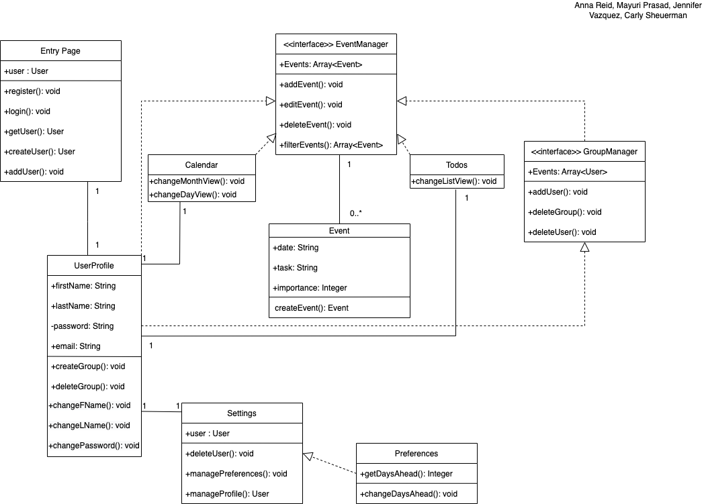
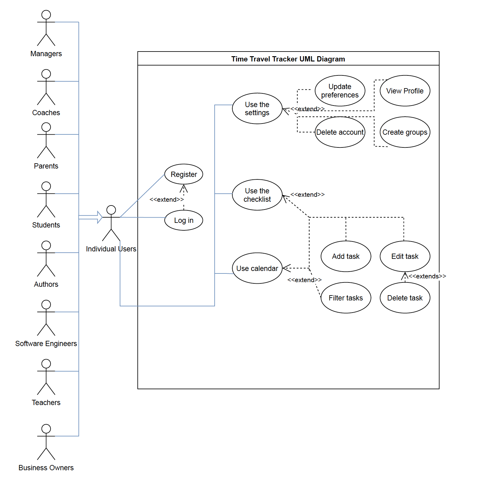

# time-travel-tracker

Time Travel Tracker is an application for all your planning needs!

Carly, Jen, Mayuri, and Anna are building a full stack web application using React, Flask, and MongoDB to help users organize their schedules.

The primary goal of Time Travel Tracker is to remind users of their events EARLY, so that they can get their tasks done well in advance of deadlines.

In this repository, we are using Pycodestyle for backend (https://code.visualstudio.com/docs/python/linting) and Prettier for frontend (https://marketplace.visualstudio.com/items?itemName=esbenp.prettier-vscode) in VSCode.

# UI Prototype

Our initial UI Prototype in Figma is here: https://www.figma.com/file/ruKAGC8bHKblsD12eie8a0/UI-Prototyping-307?node-id=0%3A1
This was last updated on October 29th, 2021.

# Development Environment

To begin contributing to this repository, we recommend downloading VSCode as your IDE (https://code.visualstudio.com/)

`git clone https://github.com/AnnaReid22/time-travel-tracker.git`

into your preferred local location.

Access the `/frontend` directory of your local copy of the repository. In this folder, run:

`npm install`

If you do not have Node Package Manager installed on your local machine, you can install it here: https://www.npmjs.com/

After installation is complete, run 

`npm start`

in your `/frontend` directory, and this should begin `localhost:3000` on your browser of choice.

Now, access your `/backend` directory, and if you do not have `python3` installed, do so here: https://www.python.org/downloads/. 

After this, you will need to set up your virtual backend environment. Follow the instructions here to do so https://flask.palletsprojects.com/en/2.0.x/installation/ using server.py as your FLASK_APP and development as your FLASK_ENV.

After setting up and running your local backend virtual environment install all of the python libraries in `requirements.txt`, and run

`flask start`

You should now be able to contribute to this repository, once you get proper access keys. If you want to make changes, please create a branch and submit a pull request.

# Diagrams

# Class Diagram

Last Updated: October 25th, 2021

# Use Case Diagram

Last Updated: October 22nd, 2021