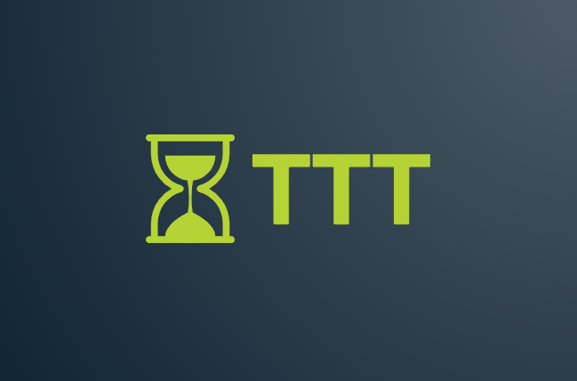

# time-travel-tracker

Time Travel Tracker is an application for all your planning needs!

Carly, Jen, Mayuri, and Anna are building a full stack web application using React, Flask, and MongoDB to help users organize their schedules.

The primary goal of Time Travel Tracker is to remind users of their events EARLY, so that they can get their tasks done well in advance of deadlines.

In this repository, we are using Pycodestyle for backend (https://code.visualstudio.com/docs/python/linting) and Prettier for frontend (https://marketplace.visualstudio.com/items?itemName=esbenp.prettier-vscode) in VSCode.
